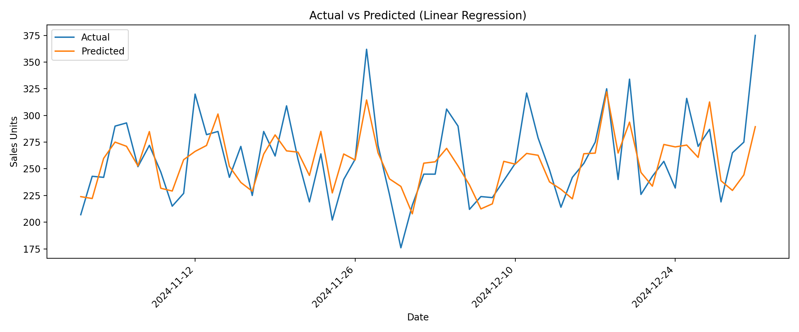
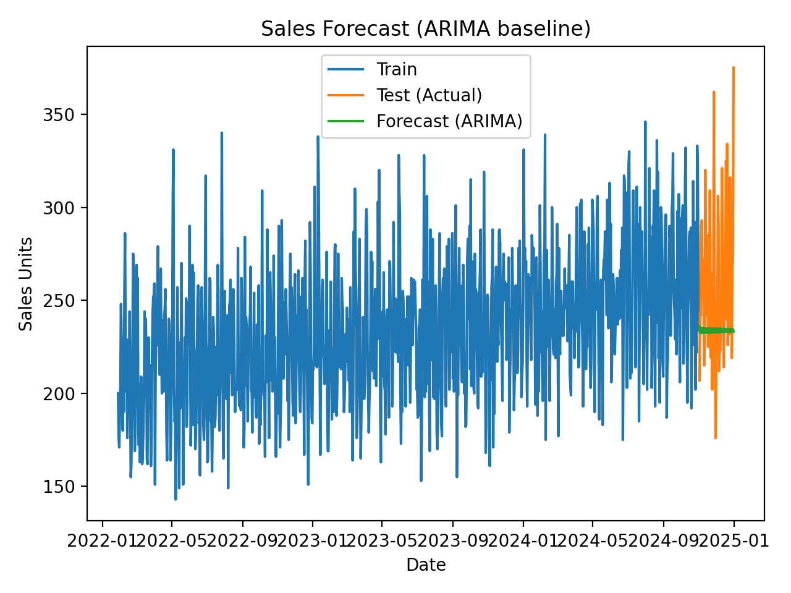

# Sales Demand Forecasting & Inventory Optimization

An end-to-end analytics project that demonstrates how raw sales data can be transformed into demand forecasts using a modular, production-style data pipeline. The project showcases time-series feature engineering regression-based forecasting, and ARIMA baselines using Python and industry-standard analytics practices.

---

## 📌 Project Overview

This project answers practical business questions such as:

- How can historical sales data be used to forecast future demand?
- How do feature-based regression models compare to classical time-series models?
- Can a clean, modular pipeline be built to support scalable forecasting workflows?
- How can forecasts support better inventory planning decisions?

The entire pipeline is script-driven and reproducible, mirroring real-world analytics and data science workflows.

---

## 🏗 Architecture

The project follows a **layered, modular pipeline architecture** with clear separation of concerns:

### 1. **Ingestion Layer**
- Generates or ingests raw daily sales data.
- Writes raw data to disk in a standardized format.

### 2. **Processing Layer**
- Cleans raw sales data.
- Engineers time-based features such as:
  - Day of week
  - Week of year
  - Lag features
  - Rolling averages
- Outputs a modeling-ready dataset.

### 3. **Analytics Layer**
- Trains and evaluates forecasting models:
  - Linear Regression (feature-based)
  - ARIMA (univariate baseline)
- Computes evaluation metrics (MAE, RMSE, MAPE).
- Produces forecast visualizations.

### 4. **Reporting Layer**
- Saves plots and results for downstream analysis and presentation.

This structure closely mirrors production-grade analytics and data science systems.

---

## 📊 Results

The forecasting pipeline was evaluated using a **time-based train–test split** (last 60 days held out) and two baseline models: a feature-based Linear Regression model and a univariate ARIMA model.

### Model Performance

| Model                     | MAE   | RMSE  | MAPE |
|---------------------------|-------|-------|------|
| Linear Regression (Features) | 21.90 | 27.14 | 8.31% |
| ARIMA (2,1,2) Baseline       | 35.64 | 47.15 | 12.71% |

### Key Insights

- The **feature-based Linear Regression model outperformed ARIMA** across all evaluation metrics.
- Lagged sales features (`sales_lag_1`, `sales_lag_7`) and rolling averages significantly improved short-term forecast accuracy.
- ARIMA captured overall trend behavior but struggled with volatility and short-term fluctuations.
- Feature engineering provided stronger predictive power than purely time-series modeling for this dataset.

### Visual Outputs

- **Actual vs Predicted (Linear Regression)**  
  Shows close alignment between predicted and actual sales over the test window.

- **Sales Forecast (ARIMA Baseline)**  
  Illustrates trend-based forecasting with higher error during periods of rapid change.

  ---

## 💻 Code

The project is implemented using a modular, production-style pipeline. Key scripts include:

- **Data Ingestion**  
  [`generate_sales_data.py`](src/ingestion/generate_sales_data.py)  
  Generates or loads raw daily sales data used as pipeline input.

- **Data Processing / Feature Engineering**  
  [`clean_sales_data.py`](src/processing/clean_sales_data.py)  
  Cleans raw data, handles missing values, and engineers time-based and lag features.

- **Forecasting & Analytics**  
  [`forecast_sales.py`](src/analytics/forecast_sales.py)  
  Trains baseline forecasting models (Linear Regression and ARIMA), evaluates performance (MAE, RMSE, MAPE), and generates plots.

- **Pipeline Orchestration**  
  [`run_pipeline.py`](src/run_pipeline.py)  
  Runs the full end-to-end workflow: ingestion → processing → forecasting → output generation.


### 📈 Model Visualizations

**Actual vs Predicted (Linear Regression)**  


**Sales Forecast (ARIMA baseline)**  


### Business Interpretation

- An **8.31% MAPE** indicates the model is suitable for **inventory planning and demand forecasting** use cases.
- Improved forecast accuracy enables:
  - Reduced stockouts
  - Lower holding costs
  - More reliable replenishment planning


## 📂 Project Structure
```text
sales-demand-forecasting-inventory-optimization/
├── data/
│   ├── raw/
│   │   └── sales_data.csv
│   └── processed/
│       └── sales_features.csv
├── images/
│   ├── actual_vs_pred.png
│   └── forecast_plot.png
├── src/
│   ├── ingestion/
│   │   └── generate_sales_data.py
│   ├── processing/
│   │   └── clean_sales_data.py
│   ├── analytics/
│   │   └── forecast_sales.py
│   └── run_pipeline.py
├── LICENSE
└── README.md


